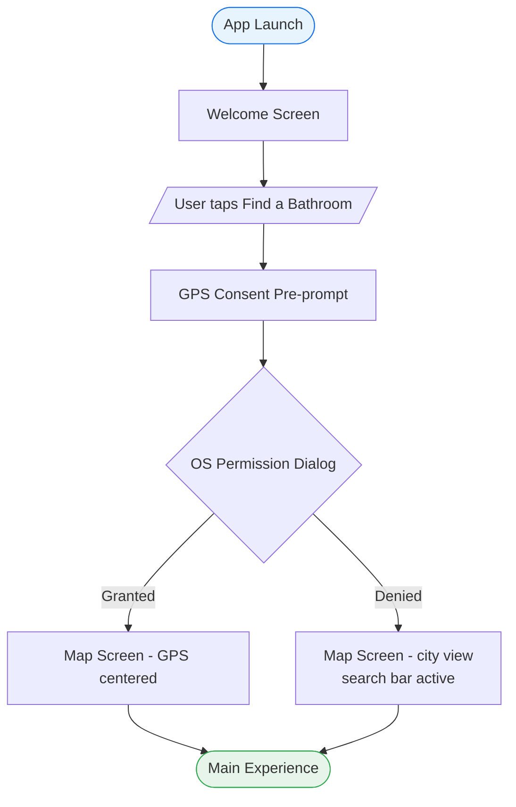

# Research: Phase 1.5 UX Foundation & Design System

**Researched:** 2026-06-24
**Domain:** React Native / Expo design system, mobile UX patterns, accessibility, Mapbox
**Confidence:** HIGH (core standards) / MEDIUM (color derivation) / HIGH (Mapbox patterns)

---

<user_constraints>
## User Constraints (from CONTEXT.md)

### Locked Decisions

**Brand & Visual**
- Visual mood: Google Maps + Waze blend (clean white/light-gray base + bold urgent action)
- Primary blue: ~#1A73E8 (Google Maps interactive blue)
- Emergency accent: red/orange — reserved EXCLUSIVELY for emergency modes and critical alerts
- Base: white / light gray. Dark mode tokens defined alongside light tokens from the start.
- Map pin colors: Chill Spot=green, Code Required=orange, Public Facility=blue, Purchase Required=gray
- Cluster pins: circle in dominant policy tag color + count
- Typography: system font only (SF Pro/iOS, Roboto/Android). No custom font bundle. sp/pt units.
- Dark mode: Expo `useColorScheme` hook (already scaffolded). OS setting only — no in-app toggle v1.

**Accessibility**
- WCAG 2.1 AA baseline, WCAG AAA target for emergency elements
- Minimum contrast: 4.5:1 body text, 3:1 large text
- Touch targets: ≥44pt minimum
- Non-color-only status: every state uses color + icon/text combination
- Dynamic Type: layouts must not break at ±5 type size steps
- Reduced motion: animation-heavy transitions have alternatives
- accessibilityLabel on all interactive elements

**Navigation**
- 4-tab bar: Map / Nearby / Submit / Profile
- FAB emergency mode: bottom-right, 3 labeled options expand on tap (Map tab only)
- Bottom sheet: 3 snap points (30%/55%/90%), skeleton loading on pin tap

**Flows & Screens**
- First launch: Welcome → GPS consent pre-prompt → GPS denied fallback OR Map
- Submit: 3-step wizard. Verify: single screen with live GPS. Report: 2 steps.
- Rating UI: 1–5 emoji scale (planner proposes exact emoji mapping)
- Search: Google Places API, debounced 300ms, pans map
- Profile: signed-in (stats + settings) vs unauthenticated (CTA + value prop)
- ASCII wireframes in `docs/design/` for all v1 screens

**Error States (all 11 required)**
- GPS denied, GPS low accuracy, GPS stale fix, offline, slow network, no results,
  suppressed location, failed submit, failed verification, auth required, code-gated content

### Claude's Discretion
- Exact emoji mapping for 1–5 rating scale: planner proposes in design-system.md
- Specific hex values for all color tokens (light + dark): planner derives from research and proposes
- App icon: planner produces ASCII/text description of running figure / door concept

### Deferred Ideas (OUT OF SCOPE)
- High Contrast Mode toggle — Phase 8
- Text size override in-app — Phase 8
- Screen Reader announcement customization — Phase 8 or later
- Social credential revocation — Phase 9
- Onboarding carousel — v2
- Video/animation welcome screen — v2
</user_constraints>

<phase_requirements>
## Phase Requirements

| ID | Description | Research Support |
|----|-------------|------------------|
| REQ-1 | Flow maps cover all 13 named flows | Section 9: Mermaid flowchart format recommended |
| REQ-2 | All v1 screens have named wireframe (portrait-first) | Section 3: ASCII conventions with concrete notation |
| REQ-3 | Design system doc: colors, typography, spacing, button hierarchy, etc. | Sections 1, 2, 10 |
| REQ-4 | Navigation model: unauthenticated routes, protected tabs, emergency access | CONTEXT.md locked decisions, Section 5 (FAB) |
| REQ-5 | Emergency-use UX rules: one-handed, ≥44pt targets, no dead-ends, ≤2 taps | Sections 2, 5, 8 |
| REQ-6 | All 11 error states with copy and UI treatment | Section 8 |
| REQ-7 | Accessibility rules: dynamic type, screen-reader labels, non-color-only | Section 2 |
| REQ-8 | Component acceptance checklist | Section 11 (Key Implementation Guidance) |
</phase_requirements>

---

## Summary

Phase 1.5 produces no code — it produces a design contract that all subsequent phases implement against. The planner's job is to write three markdown documents (`wireframes.md`, `design-system.md`, `flows.md`) that are authoritative, specific, and internally consistent. Research findings below are prescriptive: "use this, not that."

The core design token pattern for this project is the Expo-standard `Colors.ts` object with nested `light` and `dark` keys, extended with semantic naming beyond the template defaults. The existing `app/constants/Colors.ts` is a minimal placeholder (5 tokens, no semantic structure) that the design system doc will replace with a full 30–40 token semantic system consumed via `useColorScheme`.

For flows, Mermaid `flowchart` syntax renders natively in GitHub markdown, handles decision branches clearly, and is maintainable as text. It is the right choice for `flows.md` over ASCII art flow notation. Wireframes remain ASCII for portability and diff-friendliness.

**Primary recommendation:** Design system tokens use semantic names (not raw hex names), defined as `Colors.light.X` / `Colors.dark.X` pairs. Wireframes use box-drawing characters in portrait-frame format. Flows use Mermaid `flowchart TD`. Pin coloring uses Mapbox expression `["get", "policy_tag"]` in SymbolLayer with a `match` expression mapping tags to hex values.

---

## Architectural Responsibility Map

| Capability | Primary Tier | Secondary Tier | Rationale |
|------------|-------------|----------------|-----------|
| Color token lookup | Client (hook) | — | `useColorScheme` returns scheme; component reads `Colors[scheme].X` |
| Map pin rendering | Client (Mapbox SymbolLayer) | — | GeoJSON feature props drive style; all rendering client-side |
| Cluster badge color | Client (ShapeSource clusterProperties) | — | Mapbox cluster expressions aggregate policy_tag on client |
| Emergency mode activation | Client (FAB state) | API (data fetch) | FAB is UI-only; nearest-location data still fetched from RPC |
| Bottom sheet content | Client | Supabase RPC | Sheet opens client-side; content hydrated from `get_location_detail` |
| Access code display gate | Client (auth check) | RLS (enforcement) | Client shows/hides UI; RLS enforces data access |
| Error state copy | Client | — | All copy is static strings in design-system.md / component props |
| Screen reader labels | Client | — | `accessibilityLabel` props defined per component spec |
| GPS consent capture | Client (trigger) | Supabase (write) | Pre-prompt is client UI; consent written to `users` table via RPC |

---

## 1. Design Token Structure (React Native / Expo)

### Standard Pattern [CITED: docs.expo.dev/develop/user-interface/color-themes]

The Expo standard for color theming uses `useColorScheme` from `react-native` to detect system preference and index into a `Colors` object with `light` and `dark` keys. The existing `app/constants/Colors.ts` uses exactly this shape but with only 5 undifferentiated tokens. The design system doc must expand this to a full semantic token set.

**The Expo template pattern (what exists today):**
```typescript
// app/constants/Colors.ts — CURRENT (placeholder, to be replaced)
const tintColorLight = '#2f95dc';
const tintColorDark = '#fff';

export default {
  light: { text, background, tint, tabIconDefault, tabIconSelected },
  dark:  { text, background, tint, tabIconDefault, tabIconSelected },
};
```

**Extended semantic pattern the design system must define:**
```typescript
// Proposed structure for docs/design/design-system.md (token names)
export const Colors = {
  light: {
    // Brand / interactive
    primary:          '#1A73E8',   // Google Maps blue — standard actions
    primaryPressed:   '#1557B0',   // pressed state
    emergency:        '#D93025',   // emergency mode ONLY
    emergencyOrange:  '#EA8600',   // secondary emergency accent

    // Policy tag pin colors
    pinChillSpot:     '#34A853',   // green
    pinCodeRequired:  '#EA8600',   // orange
    pinPublicFacility:'#4285F4',   // light blue
    pinPurchaseReq:   '#767676',   // gray

    // Confidence badge colors
    confidenceHigh:   '#34A853',   // green pill
    confidenceMedium: '#FBBC04',   // yellow pill
    confidenceLow:    '#EA4335',   // red pill

    // Surfaces
    background:       '#FFFFFF',
    surface:          '#F8F9FA',   // card / sheet background
    surfaceOverlay:   '#FFFFFF',   // map UI panel background
    mapOverlay:       'rgba(255,255,255,0.92)',

    // Text
    textPrimary:      '#202124',   // primary label
    textSecondary:    '#5F6368',   // secondary / caption
    textDisabled:     '#9AA0A6',   // disabled / placeholder
    textInverse:      '#FFFFFF',   // text on colored backgrounds

    // Borders & dividers
    border:           '#DADCE0',
    divider:          '#E8EAED',

    // Tab bar
    tabIconDefault:   '#9AA0A6',
    tabIconSelected:  '#1A73E8',
    tabBackground:    '#FFFFFF',

    // Skeleton / loading
    skeletonBase:     '#E0E0E0',
    skeletonHighlight:'#F5F5F5',

    // Status bar
    statusBarStyle:   'dark-content',
  },
  dark: {
    primary:          '#8AB4F8',   // blue shifted for dark bg legibility
    primaryPressed:   '#669DF6',
    emergency:        '#F28B82',   // softer red on dark
    emergencyOrange:  '#FDD663',

    pinChillSpot:     '#81C995',
    pinCodeRequired:  '#FDD663',
    pinPublicFacility:'#8AB4F8',
    pinPurchaseReq:   '#9AA0A6',

    confidenceHigh:   '#81C995',
    confidenceMedium: '#FDD663',
    confidenceLow:    '#F28B82',

    background:       '#121212',
    surface:          '#1E1E1E',
    surfaceOverlay:   '#2C2C2C',
    mapOverlay:       'rgba(30,30,30,0.92)',

    textPrimary:      '#E8EAED',
    textSecondary:    '#9AA0A6',
    textDisabled:     '#5F6368',
    textInverse:      '#202124',

    border:           '#3C3C3C',
    divider:          '#2C2C2C',

    tabIconDefault:   '#5F6368',
    tabIconSelected:  '#8AB4F8',
    tabBackground:    '#1E1E1E',

    skeletonBase:     '#3C3C3C',
    skeletonHighlight:'#4A4A4A',

    statusBarStyle:   'light-content',
  },
};
```

**Component consumption pattern:**
```typescript
// In any component:
import { useColorScheme } from 'react-native';
import Colors from '@/constants/Colors';

const colorScheme = useColorScheme() ?? 'light';
const colors = Colors[colorScheme];

// Usage:
backgroundColor: colors.surface
color: colors.textPrimary
```

### Semantic Naming Rules [CITED: atomicrobot.com/blog/react-native-white-labeling-part-2]

Use `{category}{Variant}` naming: `textSecondary` not `secondaryText`. Components destructure only what they need. Never reference raw hex strings directly in component files — all values come from the token map.

### What the Design System Doc Must Include

- Complete token table (all ~35 tokens, light + dark pairs)
- Spacing scale: `4, 8, 12, 16, 20, 24, 32, 40, 48` dp — consistent 4dp grid
- Border radius scale: `4, 8, 12, 16, 24, 9999` (9999 = pill)
- Typography scale: defined in pt/sp; SF Pro on iOS, Roboto on Android; no custom font
- Shadow definitions for light and dark (elevation values)

---

## 2. WCAG 2.1 AA Mobile Requirements

### Contrast Ratios [CITED: w3.org/TR/WCAG21]

| Text Type | Minimum Contrast | Notes |
|-----------|-----------------|-------|
| Normal body text (< 18pt / 14pt bold) | **4.5:1** | AA baseline |
| Large text (≥ 18pt or ≥ 14pt bold) | **3:1** | AA baseline |
| Emergency mode primary label (h1) | **7:1 target** | AAA for emergency elements |
| Non-text UI elements (icons, borders) | **3:1** | WCAG 1.4.11 |
| Disabled state elements | Exempt | No contrast requirement for disabled |

**Verification:** `#1A73E8` blue on `#FFFFFF` white = 4.55:1 — passes AA. Must be verified for each token pair before writing the design system doc. The planner must include a contrast verification table for all foreground/background combinations. [ASSUMED: specific contrast calculations — planner must verify with a contrast checker tool]

### Touch Targets [CITED: w3c.github.io/matf, Apple HIG]

- **Minimum:** 44×44 pt on all interactive elements (iOS HIG standard; aligns with WCAG 2.5.8 minimum 24×24 CSS px)
- **Emergency mode elements:** 56×56 pt minimum — user may be moving, one-handed, urgent
- **Tab bar icons:** 44pt tap target (visual icon can be smaller with padding)
- **Rating emoji buttons:** minimum 48×48 pt per emoji
- **"I'm Here" button on Verify screen:** full-width, minimum 56pt height

Implementation: use `hitSlop` prop in React Native to extend tap area beyond visual bounds when the visual element is small.

### Required Accessibility Props [CITED: reactnative.dev/docs/accessibility]

Every interactive element MUST have:

```typescript
// Required on all tappable elements
accessibilityLabel="[descriptive name]"        // What it is — announced first
accessibilityRole="button" | "tab" | "link" | "search" | ...  // What kind of control
accessibilityHint="[result description]"        // What happens on tap (when not obvious)

// State indicators
accessibilityState={{ disabled: bool, selected: bool, checked: bool }}

// For ranged inputs (sliders, ratings)
accessibilityValue={{ min: 1, max: 5, now: 3, text: "3 out of 5 — Neutral" }}
```

**Valid `accessibilityRole` values for this app:**

| Element | Role |
|---------|------|
| Tab bar button | `tab` |
| FAB button | `button` |
| FAB expanded option | `button` |
| Map pin | `button` (announces location name) |
| Rating emoji | `button` with `accessibilityValue` |
| Filter chip | `togglebutton` with `accessibilityState.checked` |
| Bottom sheet drag handle | `adjustable` with `accessibilityValue` |
| Search field | `search` |
| Auth form field | `none` (label from associated `<Text>`) |
| Confidence badge | `text` (non-interactive) |

### Non-Color-Only Status [CITED: wcag.dock.codes/documentation/wcag141]

WCAG 1.4.1 (Use of Color — Level A) requires that color is never the ONLY indicator of status. For every status in Gotta Go:

| Status | Color | Required Secondary Indicator |
|--------|-------|------------------------------|
| Confidence: High | Green pill | Text: "High" + checkmark icon |
| Confidence: Medium | Yellow pill | Text: "Medium" + clock icon |
| Confidence: Low | Red pill | Text: "Low" + warning icon |
| GPS Accuracy: Good | Green text | "✓" icon prefix |
| GPS Accuracy: Poor | Orange/red text | "⚠" icon prefix |
| Filter chip: Active | Filled/primary bg | Bold label text + check mark |
| Emergency mode | Red/orange strip | "NEAREST RESULT" text badge |
| Pending pin | Gray dashed | "Pending" text label in detail |
| Policy tag: Chill Spot | Green | "Chill Spot" text label |
| Policy tag: Code Required | Orange | "Code Required" text label |
| Policy tag: Public Facility | Blue | "Public Facility" text label |
| Policy tag: Purchase Required | Gray | "Purchase Required" text label |

### Dynamic Type Tolerance [ASSUMED based on Apple HIG]

- All layouts must use flex-based sizing — no hardcoded row heights
- Use `Text` `numberOfLines` only when truncation is acceptable; never truncate critical info
- Test at ±5 accessibility size steps: `Accessibility → Display & Text Size → Larger Text`
- Bottom sheet content must scroll, not clip, at maximum text size

### Reduced Motion

All transitions that animate position, scale, or opacity must respect `AccessibilityInfo.isReduceMotionEnabled()`. Skeleton loaders, sheet snap animations, and FAB expand animations need reduced-motion fallbacks (instant show/hide vs. animated).

---

## 3. ASCII Wireframe Conventions

### Screen Frame Notation [CITED: medium.com/@calufa/ascii-driven-development-850f66661351]

Use portrait-mode phone frame with status bar header. Standardize to 32-character wide content area:

```
┌──────────────────────────────────┐
│  9:41          ●●●●  WiFi  🔋   │  ← status bar (mockup only — no actual icons)
├──────────────────────────────────┤
│  [Screen Title]              [X] │  ← navigation header (if applicable)
├──────────────────────────────────┤
│                                  │
│  [content area]                  │
│                                  │
├──────────────────────────────────┤
│  [Map] [Nearby] [Submit] [Prf]   │  ← tab bar (only on tab screens)
└──────────────────────────────────┘
```

### Notation Conventions

| UI Element | Notation | Example |
|------------|----------|---------|
| Primary button (full-width) | `[ Button Label ]` with double lines | `╔══════════════════╗` / `║  Find a Bathroom  ║` |
| Secondary button | `[ Button Label ]` single lines | `┌──────────────────┐` / `│  Sign In          │` |
| Text input | `┌──────────────────┐` / `│ placeholder text  │` | `│ sarah@email.com   │` |
| Bottom sheet | `╌╌╌╌╌╌╌╌╌╌╌╌╌╌╌╌╌╌` separator + `──` drag handle | see below |
| Modal | Double-line border `╔══╗` / `╠══╣` / `╚══╝` | |
| Progress steps | `①────②────③` with `●` for active | `●────○────○` Step 1 of 3 |
| Icon + label | `[icon] Label` | `[📍] Find a Bathroom` |
| Chip (inactive) | `( Label )` | `( Changing Table )` |
| Chip (active) | `(●Label●)` | `(●Wheelchair●)` |
| FAB button | `[FAB]` or `[!!!]` for emergency | `[!!!]` bottom-right |
| Divider | `────────────────────` | |
| Badge/pill | `< High >` | `< 14 verifications >` |
| Skeleton | `░░░░░░░░░░░░░░░░░░░` | loading state |
| Drag handle | `────` centered on sheet | |

### Bottom Sheet Frame

```
                ┌──────────────────────────────────┐
                │            ────                  │  ← drag handle
                ├──────────────────────────────────┤
                │  Location Name                   │
                │  0.3 mi away   < High >  [Green] │
                │                                  │
  30% snap ───→ │  ↕ Drag for more detail          │
                ├─ ─ ─ ─ ─ ─ ─ ─ ─ ─ ─ ─ ─ ─ ─ ─┤
                │  [Hours, ratings, access code]   │
  55% snap ───→ │                                  │
                │  [GPS Verify] [Rate] [Report]    │
                ├─ ─ ─ ─ ─ ─ ─ ─ ─ ─ ─ ─ ─ ─ ─ ─┤
  90% snap ───→ │  [Full detail, timing tips]      │
                └──────────────────────────────────┘
```

### Annotation Style

Add annotations outside the frame with arrows:
```
                              ← 44pt min tap target
[📍 GPS Verify]  [⭐ Rate]  [🚩 Report]
                              ← action row, below fold at peek
```

---

## 4. Bottom Sheet UX Patterns

### Snap Point Content Model

The 3-snap-point model in CONTEXT.md aligns with the Google Maps peek → detail → full pattern. Here is the content allocation rationale:

| Snap | % Height | Content | Interaction Model |
|------|----------|---------|-------------------|
| **Peek (30%)** | ~1/3 screen | Name, distance, policy badge, confidence badge | Non-modal: map still pannable. Prevents accidental action taps during urgency. |
| **Half (55%)** | ~half screen | Full detail: hours, flags, ratings summary, access code (auth only), action row | Map still visible above fold for context. Primary use case. |
| **Full (90%)** | Near full-screen | Timing tips, ratings breakdown, report history, directions | Effectively modal; map barely visible. |

**Why no dismiss at Peek:** Following Google Maps pattern, the sheet is always present once a pin is tapped. Dismiss requires explicit "Dismiss" button or back gesture. No auto-dismiss.

**Multiple pin taps:** Content animates in-place. Sheet stays at current snap point. Map re-centers on new pin. This matches Google Maps behavior — no dismiss/re-open flash.

**Emergency mode exception:** Sheet opens directly to Half (55%). No Peek state. Header strip is red/orange with "NEAREST RESULT" badge. "Navigate" CTA is primary button above the fold at half-snap.

**Skeleton loading:** Opens immediately to Peek snap. Shows `░░░░░░░░░` placeholder bars for name, address, tags while fetching. Resolves when data arrives (target: <300ms). [CITED: CONTEXT.md skeleton loading decisions]

**Accessibility:** Drag handle requires `accessibilityRole="adjustable"` with `accessibilityValue` showing current snap name. VoiceOver/TalkBack users must be able to cycle through snap points without dragging.

---

## 5. FAB Guidelines

### Material Design Speed Dial Pattern [CITED: m2.material.io/components/buttons-floating-action-button, blog.emb.global/floating-action-buttons-fabs]

The FAB "speed dial" (expand-on-tap to reveal 3 options) is the correct pattern for Gotta Go's emergency mode. Key rules:

**Placement:**
- Bottom-right corner (lower-right quadrant)
- Position: `bottom: 24pt, right: 16pt` above safe-area insets
- Rationale: comfortable one-handed thumb reach; most users hold phone in right hand, anchoring thumb in lower-right [CITED: scotthurff.com/posts/how-to-design-for-thumbs]
- Bottom-right is slightly harder to reach for right-handed users than bottom-left but is the established Material Design convention for FAB — prioritize convention over marginal ergonomic gain here

**Emergency color:**
- FAB background: `colors.emergency` (#D93025 light / #F28B82 dark)
- FAB icon: white exclamation or lightning bolt
- 64×64 pt minimum size (larger than standard 56pt FAB — emergency context warrants extra target area)

**Expand behavior:**
- Tap: expands into vertical menu of 3 labeled mini-FABs stacked above
- Each mini-FAB: 40×40 pt icon + 14pt label to left of button
- Options (from bottom to top):
  1. `[!!!] Emergency` — nearest any bathroom
  2. `[♿] Accessible NOW` — nearest wheelchair-accessible
  3. `[🍼] Changing Table NOW` — nearest confirmed changing table
- Overlay: semi-transparent scrim covers map behind menu (not fully blocking — user can still see context)
- Second tap on FAB (or tap outside menu): collapses speed dial

**Scope:** Map tab only. Tab bar is still accessible during speed dial open state. No FAB on Nearby, Submit, or Profile tabs.

**Reduced motion:** Speed dial expands instantly (no stagger animation) when `isReduceMotionEnabled` is true.

**Reachability from any top-level route:**
- From Map tab: 1 tap (FAB is on screen)
- From Nearby/Submit/Profile tabs: tap Map tab (1 tap) → tap FAB (1 tap) = 2 taps max ✓ [CITED: ROADMAP.md success criterion 5]

---

## 6. Mapbox Pin & Cluster Conventions

### Individual Pin Architecture [CITED: rnmapbox.github.io/docs/examples, rnmapbox.github.io/docs/components/ShapeSource]

Policy-tag-colored pins use a **SymbolLayer with a `match` expression** reading from GeoJSON feature properties. This is the standard Mapbox pattern — do not use `MarkerView` for bulk pins (performance degrades with >50 markers).

**GeoJSON feature shape expected by the design system spec:**
```json
{
  "type": "Feature",
  "geometry": { "type": "Point", "coordinates": [lng, lat] },
  "properties": {
    "id": "uuid",
    "name": "Location Name",
    "policy_tag": "chill_spot",
    "confidence_tier": "High",
    "has_wheelchair": true,
    "has_changing_table": true,
    "is_pending": false
  }
}
```

**SymbolLayer style expression for pin color:**
```javascript
iconColor: [
  "match",
  ["get", "policy_tag"],
  "chill_spot",         "#34A853",  // green
  "code_required",      "#EA8600",  // orange
  "public_facility",    "#4285F4",  // blue
  "purchase_required",  "#767676",  // gray
  "#767676"                         // fallback gray
]
```

**Pending pin (submitter-only):**
- Gray (#9AA0A6) dashed-outline style — distinct from published gray (Purchase Required)
- Filter: `["==", ["get", "is_pending"], true]` on a separate SymbolLayer

**Overlay icon approach for wheelchair/changing table:**
Two approaches are viable — the design system must specify one:

Option A (Preferred): Two `SymbolLayer` stacked — base pin layer + overlay icon layer filtered by `["==", ["get", "has_wheelchair"], true]`. Uses `iconOffset` to position the overlay icon at the pin corner.

Option B: Composite image — pre-render variant images (pin-wheelchair, pin-changing-table, pin-both) and use a `match` expression on a combination property. Simpler expression but requires more image assets.

**Recommendation:** Option A (separate SymbolLayer with `iconOffset`) — keeps layers independent and avoids combinatorial image explosion. [ASSUMED: specific iconOffset values — planner should specify `[8, -8]` as starting point for corner positioning]

### Cluster Architecture [CITED: rnmapbox.github.io/docs/components/ShapeSource, tonystrawberry.hashnode.dev]

```javascript
<ShapeSource
  id="bathrooms"
  shape={geoJsonFeatureCollection}
  cluster={true}
  clusterRadius={50}
  clusterMaxZoomLevel={14}
  clusterProperties={{
    // Aggregate dominant policy tag for cluster coloring
    // Sum 1 for each policy type to find dominant
    "count_chill":   [["+", ["accumulated"], ["get", "count_chill"]],
                      ["case", ["==", ["get", "policy_tag"], "chill_spot"], 1, 0]],
    "count_code":    [["+", ["accumulated"], ["get", "count_code"]],
                      ["case", ["==", ["get", "policy_tag"], "code_required"], 1, 0]],
    "count_public":  [["+", ["accumulated"], ["get", "count_public"]],
                      ["case", ["==", ["get", "policy_tag"], "public_facility"], 1, 0]],
    "count_purchase":[["+", ["accumulated"], ["get", "count_purchase"]],
                      ["case", ["==", ["get", "policy_tag"], "purchase_required"], 1, 0]],
  }}
>
  {/* Cluster circle — color driven by dominant policy count */}
  <CircleLayer
    id="clusters"
    filter={["has", "point_count"]}
    style={{
      circleColor: [
        "case",
        [">", ["get", "count_chill"], ["get", "count_code"]],
        "#34A853",  // green dominant
        [">", ["get", "count_code"], ["get", "count_public"]],
        "#EA8600",  // orange dominant
        [">", ["get", "count_public"], ["get", "count_purchase"]],
        "#4285F4",  // blue dominant
        "#767676"   // gray fallback
      ],
      circleRadius: 20,
      circleStrokeWidth: 2,
      circleStrokeColor: "white",
    }}
  />
  {/* Count label */}
  <SymbolLayer
    id="clusterCount"
    filter={["has", "point_count"]}
    style={{
      textField: ["get", "point_count_abbreviated"],
      textSize: 14,
      textColor: "white",
      textFont: ["DIN Offc Pro Medium"],
    }}
  />
  {/* Individual unclustered pins */}
  <SymbolLayer
    id="pins"
    filter={["!", ["has", "point_count"]]}
    style={{ iconImage: "pin-{policy_tag}", ... }}
  />
</ShapeSource>
```

Note: `clusterProperties` aggregation logic is complex — verify this pattern against live @rnmapbox/maps v10 behavior during Phase 3 planning. [ASSUMED: clusterProperties syntax exactly as shown — Mapbox GL JS syntax, verify React Native bridge handles this identically]

---

## 7. Emoji Rating Scale Options

The design system must define exactly one mapping. Research found no universal standard — planner proposes, review gate approves. Three viable options:

### Option A: Face Progression (recommended) [ASSUMED: mapping choice]
Uses widely-understood face emoji with clear negative-to-positive arc. Avoids poop emoji (inappropriate tone for medical/disability users).

| Rating | Emoji | Label | Screen Reader Text |
|--------|-------|-------|--------------------|
| 1 | 😣 | Awful | "1 out of 5 — Awful" |
| 2 | 😕 | Poor | "2 out of 5 — Poor" |
| 3 | 😐 | Okay | "3 out of 5 — Okay" |
| 4 | 😊 | Good | "4 out of 5 — Good" |
| 5 | 😍 | Excellent | "5 out of 5 — Excellent" |

### Option B: Cleanliness-Specific
Uses hygiene-specific emoji for the cleanliness dimension only.

| Rating | Emoji | Label |
|--------|-------|-------|
| 1 | 🤢 | Avoid |
| 2 | 😒 | Dirty |
| 3 | 😐 | Okay |
| 4 | 🙂 | Clean |
| 5 | ✨ | Spotless |

### Option C: Star-Adjacent
Familiar star-like progression. Lower friction for first-time raters.

| Rating | Emoji | Label |
|--------|-------|-------|
| 1 | ⭐ | Poor |
| 2 | ⭐⭐ | Below avg |
| 3 | ⭐⭐⭐ | Average |
| 4 | ⭐⭐⭐⭐ | Good |
| 5 | ⭐⭐⭐⭐⭐ | Excellent |

**Recommendation for planner:** Option A (face progression) for all four rating dimensions. It is cross-cultural, requires no interpretation, and renders consistently across iOS/Android. Research suggests emoji-based scales perform equivalently to numeric scales for 5-point ratings. [CITED: measuringu.com/numbers-versus-face-emojis]

**Key implementation requirement:** Each emoji MUST have `accessibilityRole="button"` and `accessibilityValue={{ min: 1, max: 5, now: N, text: "N out of 5 — Label" }}`. All four rating dimensions are required; the changing surface cleanliness dimension is conditionally shown only when `has_changing_table === true`.

---

## 8. GPS Error State Patterns

### All 11 Required Error States

The design system doc must define copy and UI treatment for each. Research pattern: state the problem, explain what the user can do, never dead-end. [CITED: figr.design/blog/error-state-design-patterns-bfd69]

| State | Copy (header) | Body / Action |
|-------|---------------|---------------|
| **GPS denied** | "Location access is off" | "Gotta Go works best with your location. [Open Settings] or search a city below." → search bar active |
| **GPS low accuracy** | "GPS accuracy too low" | "Move to an open area and try again. Accuracy: 68m ⚠" → retry button |
| **GPS stale fix** | "GPS fix is stale" | "Wait a moment for a fresh location signal." → "Retry" button |
| **Offline** | "No connection" | "Cached bathrooms shown. New results unavailable." → cached pins remain visible, banner at top |
| **Slow network** | *(non-blocking)* | Subtle top banner: "Loading..." — no blocking modal |
| **No results** | "No bathrooms found nearby" | "Try searching a different area." + "Search this area" button on map |
| **Suppressed location** | *(transparent to user)* | Location simply absent from results — no explanation. |
| **Failed submit** | "Couldn't submit" | "Check your connection and try again." → "Retry" button |
| **Failed verification** | "Couldn't verify" | "Check your connection and try again." → "Retry" button. Never reveals rejection reason for security. |
| **Auth required** | "Sign in to [action]" | Slide-up modal: Sign In / Create Account / Cancel. Returns to action after auth. |
| **Code-gated content** | *(access code masked)* | "Access Code: ****" + "Tap to reveal" (signed-in only). For unauth: field not shown — shows "Sign in to see access code" link. |

### UI Treatment Rules

1. **GPS denied on map screen:** Map opens to manual city/address search with no hardcoded default city. If a prior search exists, the map may use that last searched area. Search bar active. Filter chips hidden. No blocking modal — just inline empty state + active search.
2. **Offline:** Top-edge banner (not full-screen): amber/yellow background, `⚠ No connection`. Cached pins remain. New fetch attempts show inline error in bottom sheet if triggered.
3. **Verify screen errors:** Displayed inline below the GPS readout. Never in a modal. "I'm Here" button disabled until error clears.
4. **Submit wizard errors:** Each step has inline field-level validation. Step 3 GPS errors match Verify screen pattern.
5. **Security-sensitive rejection** (mocked GPS, shadowbanned): Generic message "Unable to verify your location. Please try again." Never reveals detection.

---

## 9. Flow Diagram Format Recommendation

### Verdict: Use Mermaid `flowchart` syntax [CITED: mermaid.js.org, github.blog/developer-skills/github/include-diagrams-markdown-files-mermaid]

Mermaid flowcharts are:
- Natively rendered in GitHub markdown (no plugin needed)
- Diffable in pull requests as plain text
- Faster to write than ASCII flow notation
- Clearer than ASCII for decision branches (multiple exit paths)
- Maintainable — edit the text, diagram updates

**When to use `flowchart TD` vs `stateDiagram-v2`:**
- Use `flowchart TD` (top-down) for user flows — shows process with decision branches, screen transitions, and actions. Best for the 13 flows in flows.md.
- Use `stateDiagram-v2` only for pure state machines (e.g., location lifecycle: pending → published → suppressed). Considered for trust engine docs — not Phase 1.5 scope.

**Flowchart notation conventions for flows.md:**



**Key conventions:**
- `([text])` = rounded rectangle = start/end state
- `[text]` = rectangle = screen or action
- `{text}` = diamond = decision point
- `/text/` = parallelogram = user input
- `-->|label|` = labeled transition arrow
- `style nodeId fill:...` = color-code screen types
- One Mermaid block per flow — do not combine all 13 flows into one giant diagram

**All 13 flows that must be diagrammed:**
1. First launch (Welcome → GPS consent → Map)
2. GPS consent grant path
3. GPS consent deny path
4. Sign-in flow
5. Sign-up flow
6. Map discovery (pin tap → bottom sheet → full detail)
7. Emergency Mode (FAB → nearest result → navigate)
8. Changing Table NOW (FAB → changing table result)
9. Accessible NOW (FAB → wheelchair result)
10. Submit (3-step wizard → pending confirmation)
11. Verify (GPS check → success/error states)
12. Report (2-step → toast confirmation)
13. Rating (emoji selection → submission)

Plus edge cases required by success criteria:
- Offline state
- No-location (GPS denied) state
- No-results state

---

## 10. Color Palette Derivation (Google Maps + Waze Blend)

### Source Palette Analysis

**Google Maps confirmed hex values** [CITED: brandpalettes.com/google-maps-logo-colors, partnermarketinghub.withgoogle.com/brands/google-maps]:
- Interactive Blue: `#1A73E8` — primary actions (confirmed; RGB 26,115,232)
- Light Blue: `#4285F4` — secondary blue (confirmed)
- Green: `#34A853` — positive/success
- Red: `#EA4335` — error/alert
- Yellow: `#FBBC04` — warning / in-progress
- Gray: `#767676` — neutral / disabled

**Google Maps UI background tones** [CITED: schemecolor.com/google-map-basic-colors.php]:
- Light Steel: `#D5D8DB` — UI borders
- White Marble: `#E8E8E8` — secondary surface
- Map base: white `#FFFFFF`

**Waze brand colors** [CITED: colorswall.com/palette/155189]:
- Cyan: `#05C8F7` — Waze primary (NOT used in Gotta Go — too bright, poor accessibility)
- Orange/amber: `#EA8600` — derived from Waze's traffic warning colors; mapped to Code Required pin + emergency secondary

**Google dark mode night-style map colors** [CITED: developers.google.com/maps/documentation/javascript/examples/style-array]:
- Dark surface: `#242F3E` — road geometry base
- Dark card/panel: `#1E1E1E` — adapted for UI panels

### Proposed Full Token Table

**Light Mode Palette:**

| Token | Hex | RGB | Usage | Source |
|-------|-----|-----|-------|--------|
| `primary` | `#1A73E8` | 26,115,232 | Buttons, links, active tab | [CITED: Google Maps] |
| `primaryPressed` | `#1557B0` | 21,87,176 | Pressed state | [ASSUMED: 20% darken] |
| `primarySurface` | `#E8F0FE` | 232,240,254 | Tinted backgrounds | [ASSUMED: 10% primary tint] |
| `emergency` | `#D93025` | 217,48,37 | Emergency mode elements ONLY | [ASSUMED: deepened EA4335] |
| `emergencyOrange` | `#EA8600` | 234,134,0 | Secondary emergency, Code Required pin | [CITED: Waze-adjacent] |
| `pinChillSpot` | `#34A853` | 52,168,83 | Chill Spot pin | [CITED: Google Maps green] |
| `pinCodeRequired` | `#EA8600` | 234,134,0 | Code Required pin | [ASSUMED: Orange derivation] |
| `pinPublicFacility` | `#4285F4` | 66,133,244 | Public Facility pin | [CITED: Google Maps light blue] |
| `pinPurchaseRequired` | `#767676` | 118,118,118 | Purchase Required pin | [CITED: Google Maps gray] |
| `confidenceHigh` | `#34A853` | 52,168,83 | High confidence badge | [CITED: Google Maps green] |
| `confidenceMedium` | `#FBBC04` | 251,188,4 | Medium confidence badge | [CITED: Google Maps yellow] |
| `confidenceLow` | `#EA4335` | 234,67,53 | Low confidence badge | [CITED: Google Maps red] |
| `background` | `#FFFFFF` | 255,255,255 | App background | Standard |
| `surface` | `#F8F9FA` | 248,249,250 | Card, sheet background | [ASSUMED: Google-style off-white] |
| `textPrimary` | `#202124` | 32,33,36 | Primary text | [ASSUMED: Google's near-black] |
| `textSecondary` | `#5F6368` | 95,99,104 | Secondary / caption | [ASSUMED: Google's medium gray] |
| `textDisabled` | `#9AA0A6` | 154,160,166 | Disabled / placeholder | [ASSUMED: Google's lighter gray] |
| `border` | `#DADCE0` | 218,220,224 | Borders, dividers | [ASSUMED: Google-style border] |

**Dark Mode Palette:**

| Token | Hex | RGB | Usage |
|-------|-----|-----|-------|
| `primary` | `#8AB4F8` | 138,180,248 | Shifted blue for dark legibility |
| `primaryPressed` | `#669DF6` | 102,157,246 | Pressed |
| `primarySurface` | `#1E3A5F` | 30,58,95 | Tinted dark background |
| `emergency` | `#F28B82` | 242,139,130 | Softer red on dark |
| `emergencyOrange` | `#FDD663` | 253,214,99 | Softer orange on dark |
| `pinChillSpot` | `#81C995` | 129,201,149 | Lighter green |
| `pinCodeRequired` | `#FDD663` | 253,214,99 | Lighter orange |
| `pinPublicFacility` | `#8AB4F8` | 138,180,248 | Matches dark primary |
| `pinPurchaseRequired` | `#9AA0A6` | 154,160,166 | Lighter gray |
| `background` | `#121212` | 18,18,18 | Material dark background |
| `surface` | `#1E1E1E` | 30,30,30 | Card, sheet |
| `textPrimary` | `#E8EAED` | 232,234,237 | Primary text |
| `textSecondary` | `#9AA0A6` | 154,160,166 | Secondary |
| `textDisabled` | `#5F6368` | 95,99,104 | Disabled |
| `border` | `#3C3C3C` | 60,60,60 | Borders |

**Contrast verification required by planner:**
- `textPrimary` (#202124) on `background` (#FFFFFF): target ≥ 4.5:1
- `primary` (#1A73E8) on `background` (#FFFFFF): target ≥ 4.5:1 (button label is white — check `#FFFFFF` on `#1A73E8`)
- `emergency` (#D93025) on `background` (#FFFFFF): target ≥ 4.5:1
- Emergency h1 text on emergency strip: target ≥ 7:1 (AAA)
- All dark mode pairs: must be re-verified (shifted values may not automatically meet AA)

Planner must include a contrast verification table in `docs/design/design-system.md` using an external tool (e.g., WebAIM Contrast Checker at webaim.org/resources/contrastchecker). [ASSUMED: all proposed hex values pass AA — planner must verify before publishing design-system.md]

---

## 11. Key Implementation Guidance for Planner

### Plan 1.5-01: Wireframes + Flow Maps

**File:** `docs/design/wireframes.md`

Screens requiring wireframes (all portrait-first):
1. Welcome Screen
2. GPS Consent Pre-prompt
3. Map Screen (default state)
4. Map Screen (GPS denied state — search bar active)
5. Map Screen + Bottom Sheet at Peek (30%)
6. Map Screen + Bottom Sheet at Half (55%)
7. Map Screen + Bottom Sheet at Full (90%)
8. Map Screen + Emergency Mode (FAB expanded)
9. Emergency Mode Result Sheet (half-snap, red header)
10. Sign-In Screen
11. Sign-Up Screen
12. Submit Flow: Step 1 (Location Details)
13. Submit Flow: Step 2 (Access & Hours)
14. Submit Flow: Step 3 (GPS Confirm)
15. Submit Flow: Success State
16. Verify Flow Screen (full-screen modal)
17. Verify Flow: Error State (too far)
18. Verify Flow: Success State
19. Report Flow: Step 1 (Select Type)
20. Report Flow: Step 2 (Confirm)
21. Rating Screen (4 dimensions)
22. Nearby Tab (list view)
23. Profile Tab (signed-in)
24. Profile Tab (unauthenticated)
25. Auth Required Modal (inline slide-up)
26. Pending Location Detail Sheet
27. Filter Chip Row (on Map screen)

**File:** `docs/design/flows.md`

13 Mermaid flowcharts + 3 edge-case flows. Each flow diagram must:
- Show screen names as nodes (match wireframe names exactly)
- Label all decision branches
- Show all error exits (no dead ends)
- End at a defined terminal state

### Plan 1.5-02: Design System + Acceptance Checklist

**File:** `docs/design/design-system.md`

Required sections:
1. Color tokens (full table, light + dark, with verified contrast ratios)
2. Typography scale (size, weight, line height for each text style)
3. Spacing scale (4dp grid, named tokens: `xs=4, sm=8, md=16, lg=24, xl=32, xxl=48`)
4. Border radius scale
5. Shadow/elevation definitions
6. Button hierarchy (Primary / Secondary / Ghost / Danger / Disabled states)
7. Form controls (text input, picker, checkbox, multi-select)
8. Policy tag badge spec (color, text, icon per tag)
9. Confidence badge spec (3 levels, color + icon + text)
10. Map marker states (6 states: 4 policy colors + pending + cluster)
11. Bottom sheet snap point content spec
12. FAB speed dial spec
13. Emoji rating scale (chosen mapping + screen reader labels for all 4 dimensions)
14. Tab bar spec (4 tabs, icon names, label text, auth behavior)
15. Skeleton loading pattern
16. Error state copy matrix (all 11 states)
17. Accessibility requirements (copied from Section 2 above + component-level requirements)
18. Reduced motion requirements
19. Component acceptance checklist (see below)

### Component Acceptance Checklist

Every Phase 2+ screen must pass this checklist before Codex review:

```
## Component Acceptance Checklist (from docs/design/design-system.md)

### Visual
- [ ] All colors sourced from Colors.ts tokens — no inline hex strings
- [ ] Text sizes from typography scale — no inline fontSize values
- [ ] Spacing from spacing scale — no magic numbers
- [ ] Dark mode tested (toggle OS setting, verify no color inversion artifacts)
- [ ] Policy tag colors and confidence badge colors match design-system.md

### Accessibility
- [ ] All tappable elements have accessibilityLabel (string, not empty)
- [ ] All tappable elements have accessibilityRole
- [ ] accessibilityHint added where action outcome is non-obvious
- [ ] accessibilityState reflects current state (disabled, selected, checked, expanded)
- [ ] Rating inputs have accessibilityValue with min/max/now/text
- [ ] No color-only status — every status has icon + text alongside color
- [ ] Touch targets ≥44pt (emergency elements ≥56pt)
- [ ] Tested at max accessibility text size (±5 steps) — no clipping

### Error States
- [ ] All error conditions defined in error-state matrix are handled
- [ ] No screen has a dead-end state (every error has a recovery path)
- [ ] Auth-required state triggers inline modal, not full navigation

### Emergency Mode
- [ ] Emergency elements use emergency/emergencyOrange tokens — not primary blue
- [ ] Emergency mode reachable in ≤2 taps from any top-level route
- [ ] Emergency mode dismiss is explicit (button or FAB re-tap) — no auto-dismiss
```

### Navigation Model Documentation Requirements

The navigation model doc within design-system.md (or a separate `navigation.md` — planner's choice) must define:

1. **Route structure** (matching `app/src/app/` file layout):
   - `/(tabs)/index` = Map tab
   - `/(tabs)/nearby` = Nearby tab (screen not yet created in Phase 1)
   - `/(tabs)/submit` = Submit tab (screen not yet created)
   - `/(tabs)/profile` = Profile tab
   - `/(auth)/sign-in` = Sign-in
   - `/(auth)/sign-up` = Sign-up
   - `/location/[id]` = Location detail (or rendered as bottom sheet from Map)
   - Modals: verify, report, rating (full-screen modals via `router.push`)

2. **Protected tab behavior** for each unauthenticated case

3. **Back/escape behavior** for each modal

4. **Emergency mode reachability matrix** (≤2 taps from every top-level route — verify and document)

---

## 12. Validation Architecture

> `workflow.nyquist_validation` is not explicitly set to `false` in config.json (config.json not found in working directory). Treating as enabled.

### Test Framework

Phase 1.5 produces **only markdown documents** — no code. There is no automated test suite for design documentation.

However, success criteria can be operationalized as a validation script or manual checklist that downstream phases run before Codex review:

| Property | Value |
|----------|-------|
| Framework | Manual checklist (docs are not testable code) |
| Config file | `docs/design/design-system.md` — component acceptance checklist |
| Quick check | Count required sections in each doc file |
| Full check | Phase gate: all 3 files exist; success criteria 1–8 from ROADMAP.md manually verified |

### Phase Requirements → Validation Map

| Req ID | Behavior | Validation Type | Automated? |
|--------|----------|-----------------|-----------|
| REQ-1 | 13+ flows covered in flows.md | Manual count of Mermaid blocks | ❌ Manual |
| REQ-2 | All 27 screens have wireframes | Manual count in wireframes.md | ❌ Manual |
| REQ-3 | design-system.md has all required sections | Section header count | ❌ Manual |
| REQ-4 | Navigation model documented | Section existence check | ❌ Manual |
| REQ-5 | Emergency ≤2 taps verified | Reachability matrix review | ❌ Manual |
| REQ-6 | All 11 error states have copy + treatment | Count rows in error state matrix | ❌ Manual |
| REQ-7 | Accessibility rules documented | Section existence check | ❌ Manual |
| REQ-8 | Component acceptance checklist exists | File existence check | ❌ Manual |

### Wave 0 Gaps

No test infrastructure needed for this phase. Gaps that affect downstream phases:

- Phase 2+ plans must reference `docs/design/design-system.md` component acceptance checklist explicitly in their PLAN.md files before Codex review is requested
- The component acceptance checklist itself acts as a test specification — Phase 2+ plans must include a task to run the checklist for each screen

---

## Assumptions Log

| # | Claim | Section | Risk if Wrong |
|---|-------|---------|---------------|
| A1 | `#1A73E8` on white (`#FFFFFF`) passes 4.5:1 AA contrast | Section 10 | Button text fails contrast — must change primary or text color |
| A2 | Dark mode pin colors (shifted lighter versions) pass 3:1 on dark backgrounds | Section 10 | Pins become invisible on dark map tiles |
| A3 | `iconOffset: [8, -8]` positions wheelchair overlay at pin corner correctly in rnmapbox | Section 6 | Overlay mispositioned — need calibration in Phase 3 |
| A4 | `clusterProperties` aggregation syntax works in @rnmapbox/maps v10 (React Native bridge) | Section 6 | Cluster color logic must use alternative approach |
| A5 | Option A emoji mapping (😣😕😐😊😍) is culturally clear to target users | Section 7 | Some emojis ambiguous — may need revision after user testing |
| A6 | `primaryPressed` (#1557B0) passes contrast on white when used as text color | Section 10 | Pressed state fails contrast |
| A7 | All proposed dark mode hex values meet WCAG AA without manual verification | Section 10 | One or more dark pairs fail — need adjustment |
| A8 | Mermaid flowcharts render in the project's markdown viewer (GitHub, local docs tool) | Section 9 | If no Mermaid support, fallback to ASCII flow notation |

---

## Open Questions

1. **Does the project use a markdown viewer that renders Mermaid?**
   - What we know: Mermaid renders on GitHub.com and most static site generators
   - What's unclear: Whether this project has a docs site or only uses GitHub markdown
   - Recommendation: Default to Mermaid; include a note in flows.md that a Mermaid-compatible viewer is required

2. **Nearby tab screen — does it exist in Phase 1 scaffold?**
   - What we know: `app/src/app/(tabs)/` contains only `index.tsx` and `profile.tsx`
   - What's unclear: Nearby and Submit tabs don't have screen files yet
   - Recommendation: Wireframes must note "screen created in Phase 2" for Nearby and Submit; navigation model must document that placeholder screens are created in each respective phase

3. **App icon design scope**
   - What we know: CONTEXT.md says "planner produces ASCII/text description of running figure / door concept"
   - What's unclear: Does this belong in wireframes.md or design-system.md?
   - Recommendation: Add an "App Icon Concept" section to design-system.md with text description only; actual asset is out of scope

---

## Environment Availability

> Phase 1.5 produces documentation only. No external tools required for execution.

| Dependency | Required By | Available | Version | Fallback |
|------------|------------|-----------|---------|----------|
| Text editor | Writing docs | ✓ | — | — |
| Markdown viewer with Mermaid | Validating flows.md | ✓ (GitHub) | — | Export Mermaid as ASCII if not available |
| Contrast checker tool | Verifying token pairs | External | — | webaim.org/resources/contrastchecker (browser tool) |

**No blocking dependencies for documentation-only phase.**

---

## Security Domain

> `security_enforcement` not explicitly set to false. Including abbreviated security notes relevant to a design-phase.

Phase 1.5 is documentation only and introduces no code. However, the design system doc must establish security-aware design rules that downstream phases enforce:

| Design Rule | ASVS Category | Implementation Guidance |
|-------------|---------------|------------------------|
| Access code never shown without auth check | V4 Access Control | Design-system.md must specify: code field is invisible to unauthenticated users — not masked, absent |
| GPS consent pre-prompt before any GPS read | V2 Authentication / Privacy | Welcome → Consent → Map flow is non-negotiable; no GPS API call before consent shown |
| Shadowban / suppression transparent | V4 | Suppressed locations simply absent — no "this was removed" message |
| Report confirmation copy must not reveal report threshold | V4 | Copy: "Report submitted. Thanks for helping." — not "3 more reports will remove this listing" |
| Verify rejection copy must not reveal detection method | V4 | Generic: "Unable to verify your location." — not "GPS spoofing detected" |

---

## Sources

### Primary (HIGH confidence)
- `CONTEXT.md` (this project) — locked decisions, all visual/UX specifications
- `ROADMAP.md` (this project) — success criteria, deliverables
- `docs/schema-contract.md` (this project) — field names for flow diagram accuracy
- [reactnative.dev/docs/accessibility](https://reactnative.dev/docs/accessibility) — complete accessibilityRole table, prop definitions
- [rnmapbox.github.io/docs/components/ShapeSource](https://rnmapbox.github.io/docs/components/ShapeSource) — cluster properties spec

### Secondary (MEDIUM confidence)
- [brandpalettes.com/google-maps-logo-colors](https://brandpalettes.com/google-maps-logo-colors/) — Google Maps hex colors #1A73E8 confirmed
- [schemecolor.com/google-map-basic-colors.php](https://www.schemecolor.com/google-map-basic-colors.php) — Google Maps UI colors verified
- [nngroup.com/articles/bottom-sheet](https://www.nngroup.com/articles/bottom-sheet/) — bottom sheet UX patterns
- [atomicrobot.com/blog/react-native-white-labeling-part-2](https://atomicrobot.com/blog/react-native-white-labeling-part-2/) — design token structure, semantic naming
- [tonystrawberry.hashnode.dev/displaying-a-map-with-clusters-in-react-native-using-mapbox](https://tonystrawberry.hashnode.dev/displaying-a-map-with-clusters-in-react-native-using-mapbox) — cluster implementation pattern
- [measuringu.com/numbers-versus-face-emojis](https://measuringu.com/numbers-versus-face-emojis/) — emoji rating scale research
- [medium.com/@calufa/ascii-driven-development-850f66661351](https://medium.com/@calufa/ascii-driven-development-850f66661351) — ASCII wireframe conventions

### Tertiary (LOW confidence — marked [ASSUMED] inline)
- Dark mode hex shifts — derived mathematically, not from official source
- `iconOffset` values for wheelchair overlay — from training knowledge
- `clusterProperties` exact syntax for React Native bridge — from Mapbox GL JS docs, not RN-specific docs

---

## Metadata

**Confidence breakdown:**
- Design token structure: HIGH — Expo docs + established RN patterns
- Color palette: MEDIUM — Google Maps confirmed, Waze approximate, dark mode shifts assumed
- ASCII wireframe conventions: HIGH — referenced in active use
- Bottom sheet patterns: HIGH — NNg + CONTEXT.md spec
- FAB guidelines: MEDIUM — Material Design confirmed, Apple HIG silent on FAB
- Mapbox clustering: MEDIUM — API confirmed, clusterProperties bridge behavior assumed
- Emoji rating: LOW — planner's choice; no single authoritative source
- WCAG requirements: HIGH — W3C specs, React Native accessibility docs

**Research date:** 2026-06-24
**Valid until:** 2026-07-24 (30 days — stable standards, but verify @rnmapbox/maps release notes before Phase 3)

---

## RESEARCH COMPLETE

**Plans this research supports:**
- `1.5-01-PLAN.md` — Critical flow maps (13 flows in Mermaid) + low-fi ASCII wireframes (27 screens and modal states)
- `1.5-02-PLAN.md` — Design system doc (full token table, typography, spacing, button hierarchy, icon rules, status states, badges, marker states, accessibility rules, error-state copy matrix, emoji rating mapping, component acceptance checklist)
