# Gotta Go — Navigation & Interaction Flows

**Phase 1.5 design contract.** This document is the canonical source of truth for every named user flow in v1. No Phase 2–8 screen ships without a flow node defined here and a matching wireframe in `docs/design/wireframes.md`.

Each H2 section contains exactly one `flowchart TD` Mermaid block. Screen node names here are canonical — `docs/design/wireframes.md` uses the same names verbatim.

**Node shape conventions:**

- `([text])` — rounded rectangle — start / terminal end state
- `[text]` — rectangle — screen or system action
- `{text}` — diamond — decision point
- `[/text/]` — parallelogram — user input / user action
- `-->|label|` — labeled transition
- Terminal states styled green; error exits styled red.

---

## First Launch Flow

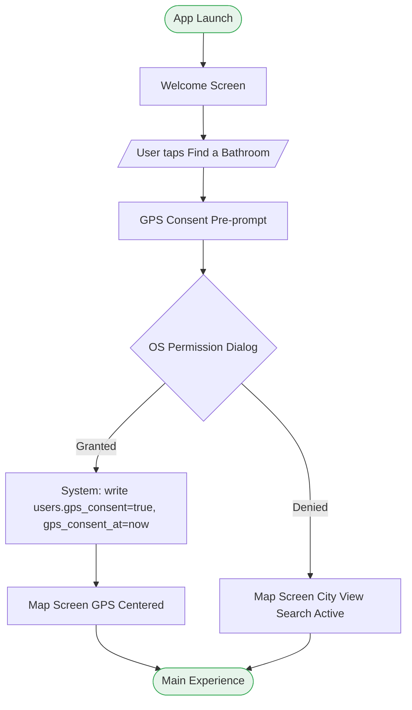

> GPS consent (the `users.gps_consent` write) occurs ONLY after the OS dialog resolves to Granted — never on the pre-prompt tap. If the OS dialog is denied, `gps_consent` remains false/unset and the app falls back to city view (no dead end).

---

## GPS Consent — Grant Path

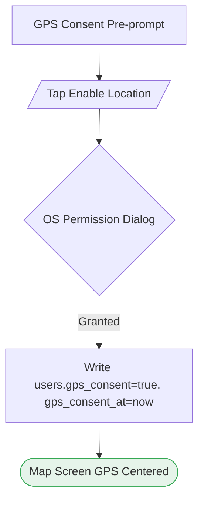

---

## GPS Consent — Deny Path

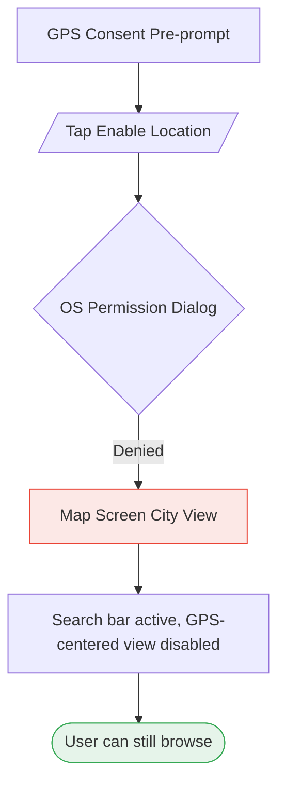

---

## Sign-In Flow

```mermaid
flowchart TD
    Trigger1[/Protected action tapped/]
    Trigger2[/Profile tab tapped (unauth)/]
    Modal[Auth Required Modal]
    Choice{Choice}
    SignIn[Sign-In Screen]
    EnterCreds[/Enter email + password/]
    AuthResult{Auth result}
    ReturnAction([Return to triggering action])
    InlineErr[Inline error: Invalid credentials]
    GoogleLink[Deep link to Google]
    OAuthResult{OAuth result}
    OAuthErr[Inline error]
    ReturnOAuth([Return to triggering action])

    Trigger1 --> Modal
    Trigger2 --> Modal
    Modal --> Choice
    Choice -->|Sign In| SignIn
    SignIn --> EnterCreds
    EnterCreds --> AuthResult
    AuthResult -->|Success| ReturnAction
    AuthResult -->|Failed| InlineErr
    InlineErr --> SignIn
    Choice -->|Google OAuth Android| GoogleLink
    GoogleLink --> OAuthResult
    OAuthResult -->|Success| ReturnOAuth
    OAuthResult -->|Failed| OAuthErr
    OAuthErr --> SignIn

    style ReturnAction fill:#E6F4EA,stroke:#34A853
    style ReturnOAuth fill:#E6F4EA,stroke:#34A853
    style InlineErr fill:#FCE8E6,stroke:#EA4335
    style OAuthErr fill:#FCE8E6,stroke:#EA4335
```

> Google OAuth is Android-only. iOS shows an "Sign in with Apple — coming soon" stub in place of the Google button.

---

## Sign-Up Flow

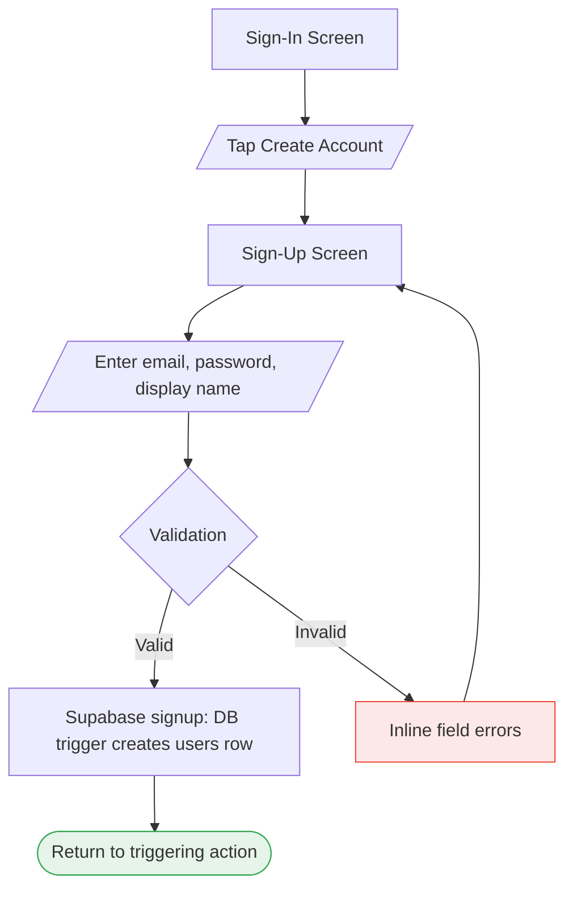

---

## Map Discovery Flow

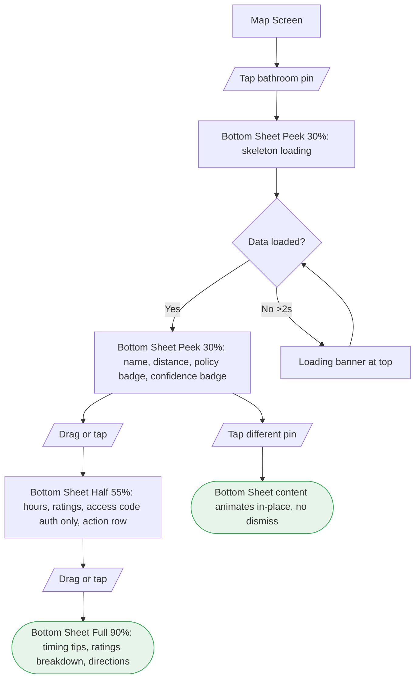

---

## Emergency Mode Flow

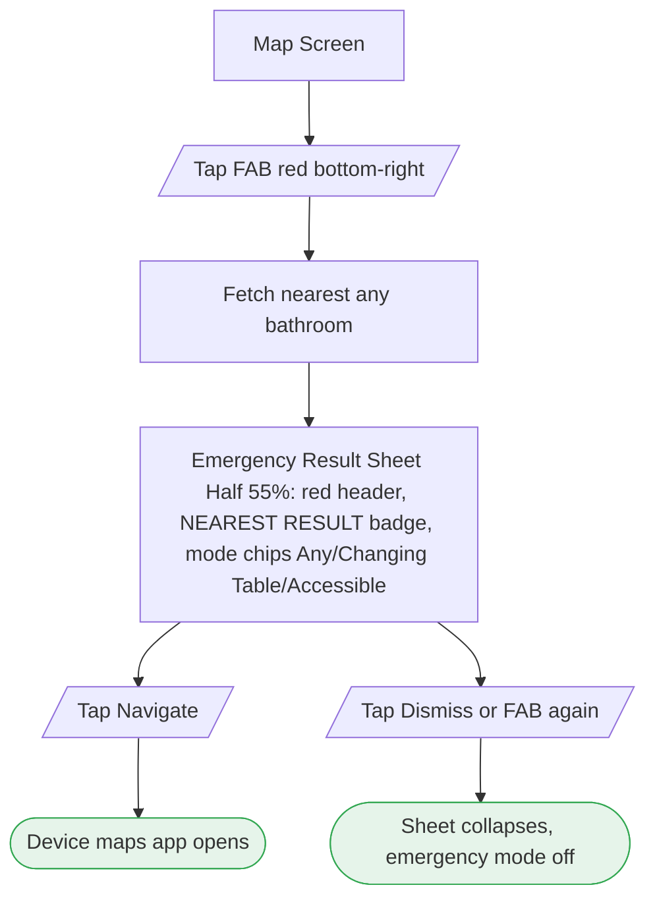

> FAB is single-tap (no expand menu). Mode switching happens via chips INSIDE the result sheet — see Changing Table NOW and Accessible NOW flows.

---

## Changing Table NOW Flow

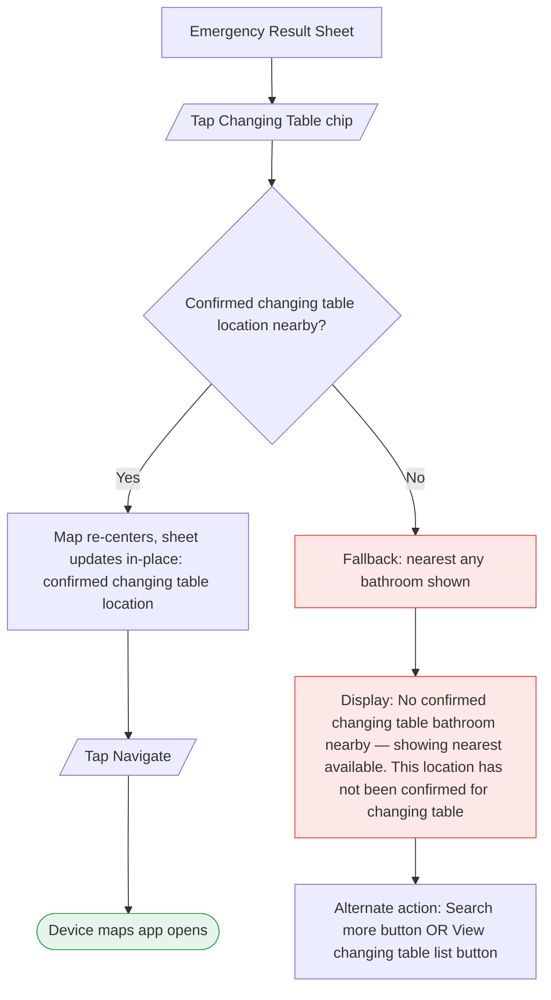

---

## Accessible NOW Flow

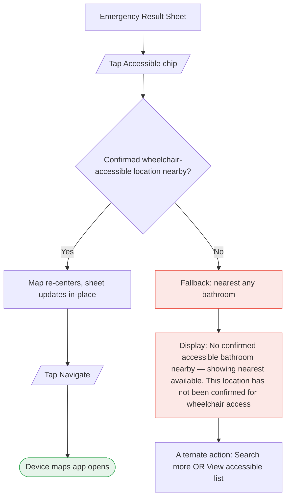

---

## Submit Flow

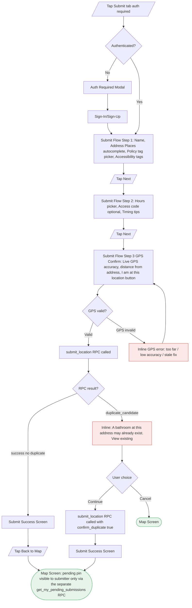

> **Server contract (STALE — needs reconciliation before citing as current):** this section originally described a client-generated `submission_id` UUID with `duplicate_candidate`/`confirm_duplicate` idempotency semantics. The live `submit_location` RPC signature (`supabase/migrations/20260707020000_phase4_submission_staging.sql`) takes `p_name, p_lat, p_lng, p_accuracy_m, p_mocked, p_captured_at, p_policy_tag, p_address, p_access_sensitivity, p_hours, p_access_code, p_timing_tip` and returns a plain `uuid` — there is no `submission_id`/`confirm_duplicate` parameter and no duplicate-candidate return shape in the shipped function. Whether client-side or server-side duplicate detection exists at all was not re-verified during this doc pass — check `04-CONTEXT.md`/`04-RESEARCH.md`/`submit.tsx` directly before relying on this diagram's duplicate-handling branch.

> **Pending pin visibility (corrected — Phase 4 implemented):** `get_my_pending_submissions()` is a separate, no-arg, `auth.uid()`-scoped RPC — not a JOIN inside the search RPCs. MapScreen renders its result as an independent Mapbox layer, never a client-side filter.

---

## Verify Flow

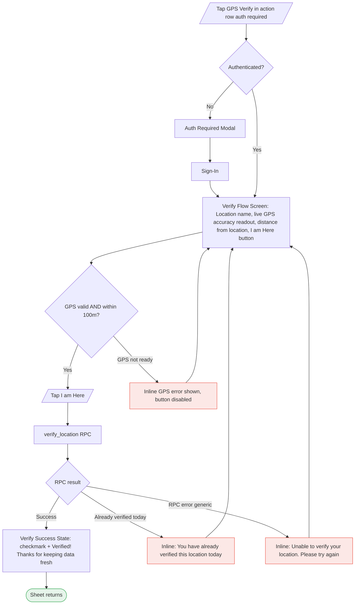

> Security-sensitive rejections (mocked GPS, shadowbanned) surface the generic copy "Unable to verify your location. Please try again." — never a specific reason that reveals detection.

---

## Report Flow

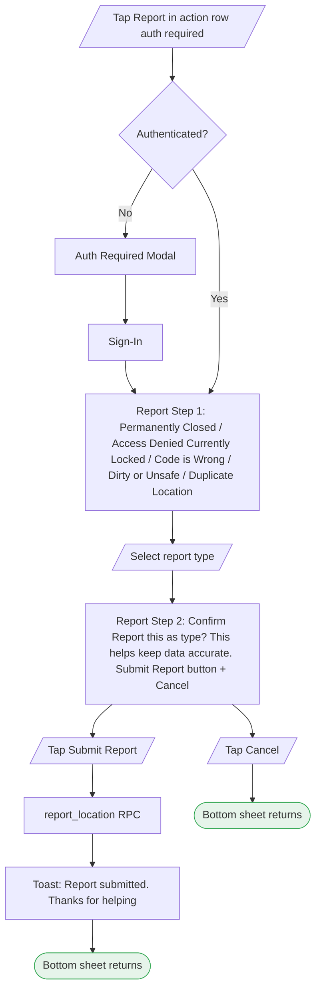

**Report type DB mapping (for Phase 7 implementation):**

| User Label | DB value (reports.report_type) |
|---|---|
| Permanently Closed | permanently_closed |
| Access Denied / Currently Locked | currently_locked |
| Code is Wrong | inaccurate_information |
| Dirty or Unsafe | dirty_unsafe |
| Duplicate Location | duplicate_location ⚠ NOT in live CHECK constraint — Phase 7 must add via migration |

> **Schema dependency (RC-02):** The live `reports.report_type` CHECK constraint does NOT include 'duplicate_location'. Phase 7's `report_location` RPC will hit a DB constraint violation unless this migration runs first: add 'duplicate_location' to the CHECK array in `reports`.

---

## Rating Flow

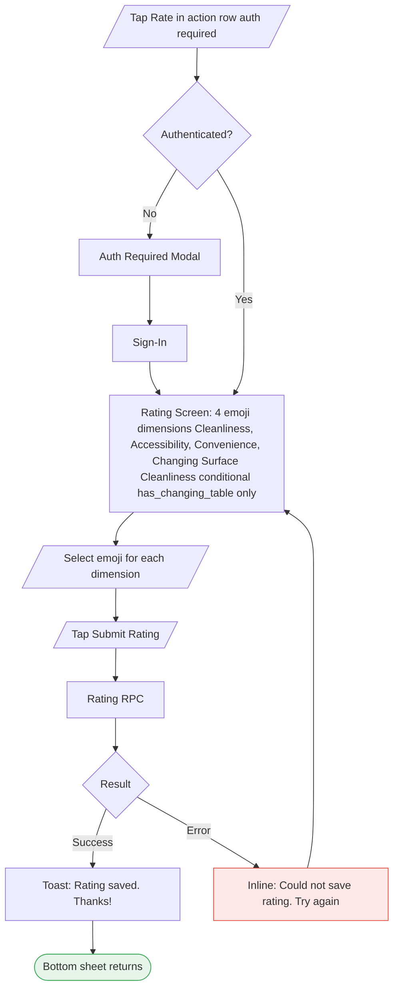

> `has_changing_table` is derived from the `tags` table, not a `locations` column. The Changing Surface Cleanliness dimension only renders when `tags.find(t => t.key === 'has_changing_table')?.value === 'true'`.

---

## Offline State Flow

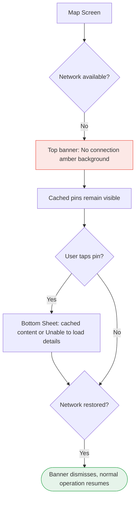

---

## No-Location (GPS Denied) State Flow

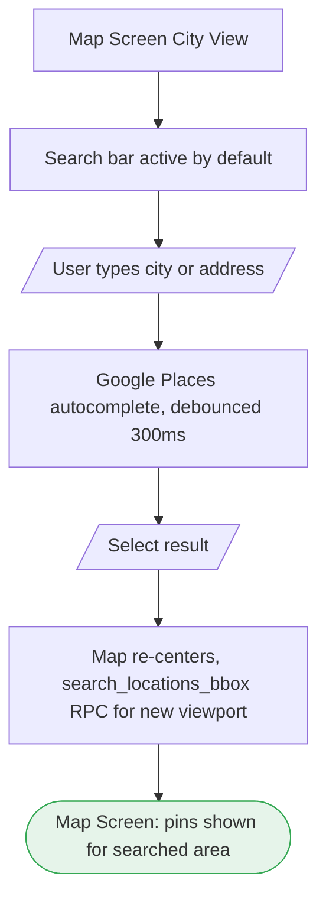

---

## No-Results State Flow

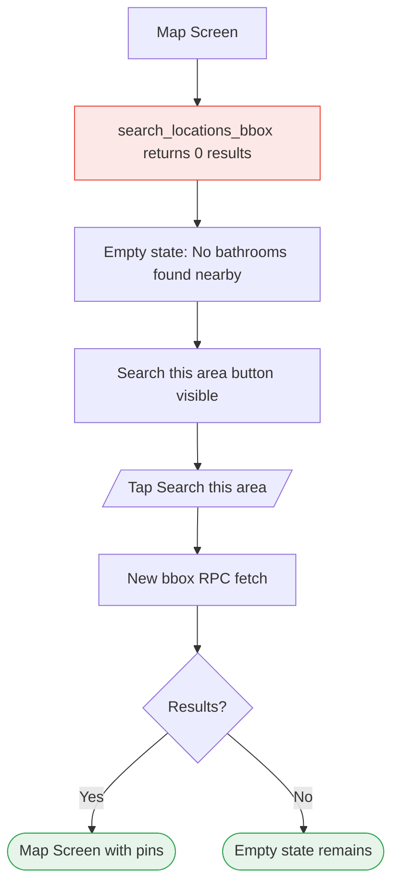

---
## Notes for Implementors
- Screen node names in these diagrams are the canonical names. Wireframes in `docs/design/wireframes.md` use the same names.
- All Mermaid blocks require a Mermaid-compatible viewer (GitHub.com renders these natively).
- "Auth Required Modal" in flows maps to the inline slide-up sheet (not full navigation).
- Suppressed locations appear absent from results — no flow node for suppression (transparent to user per security rules).
